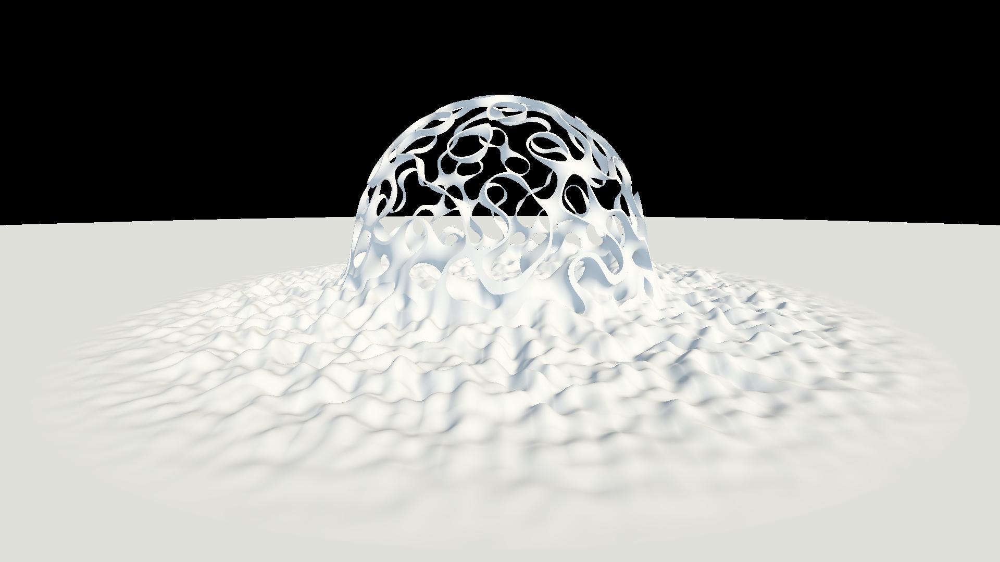
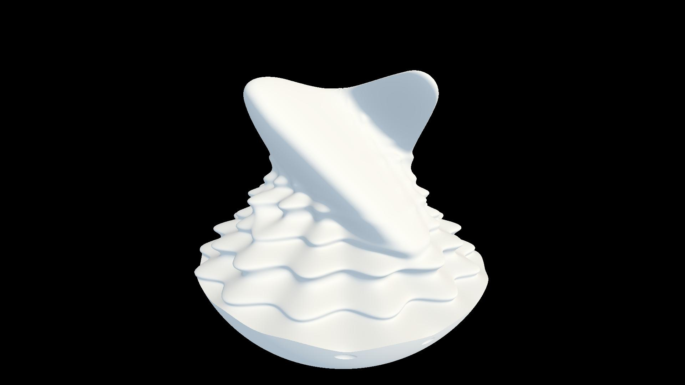
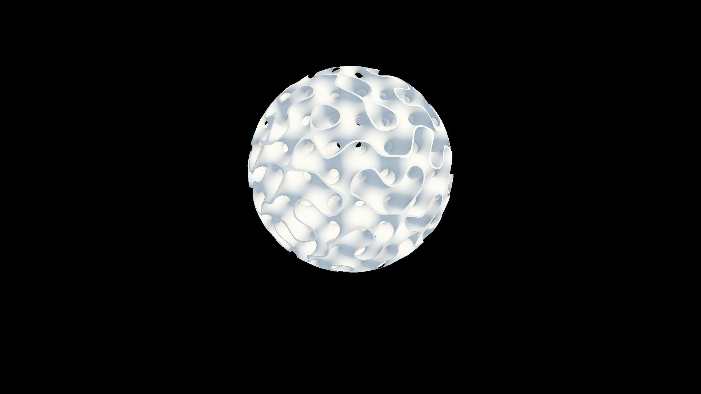

# raymarch
a repo for me to play with raymarching on the GPU

# screenshots of a few things i made

# features
- edit shaders and see updates immediately (on file modification)
- press "p" to dump renders in the images directory
- press "t" to toggle time
- smart rendering when time sopped
  - renders only if window resized or code is updated
- press "f" to toggle full screen
